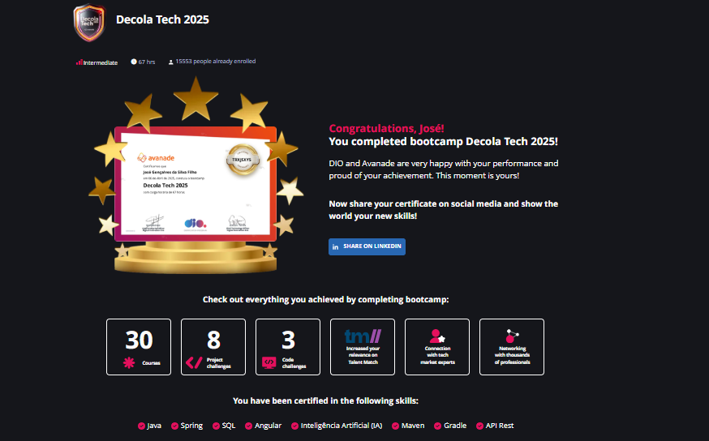

<h1 >Decola-Tech-2025 🚀</h1>

## Sobre o Bootcamp

Chegou o **Decola Tech Avanade 2025**! Uma super oportunidade de aprendiazdo de tecnologias impares para o mercado de trabalho.

O programa conta com uma trilha educacional online focada em **Spring Boot** e **Angular**, onde as pessoas candidatas poderão aprender desde o básico até criarem e publicarem suas próprias APIs, se tornando **full stacks** e desenvolvendo projetos práticos junto com experts. A trilha completa tem 67 horas de duração e oferece certificação para os concluintes.

---

<h1 >Repositorios</h1>

### 1. **Java**

Focado em conceitos avançados da linguagem **Java**, como **Streams**, **APIs**, **JDBC**, **SPRING DATA** e construções de projetos, assim como boas práticas.

[🔗 Acesse aqui](./content/Java/)

### 3. **Desenvolvimento Web com ANGULAR**

Inclui conteúdos sobre **HTML**, **CSS** e **JavaScript** para criar páginas web interativas e responsivas, a base pra ultiliação do freamwork moderno Angular e toda duas biblioteca **Ng\*\*** para criação de paginas reativas e moderna, todo aprendizado consolidado em projetos durante a trilha.  
[🔗 Acesse aqui](./content/Angular/)

---

<h1 > Tecnologias Utilizadas</h1>

Durante o bootcamp, você terá contato com as seguintes tecnologias:

| Tecnologia      | Descrição                                                             | Logo                                                                                                             |
| --------------- | --------------------------------------------------------------------- | ---------------------------------------------------------------------------------------------------------------- |
| **Spring Boot** | Framework Java para criação de aplicações robustas e escaláveis.      |  |
| **Angular**     | Framework TypeScript para desenvolvimento de aplicações web modernas. |                              |
| **HTML**        | Linguagem de marcação para estruturação de páginas web.               |          |
| **CSS**         | Linguagem de estilo para design e layout de páginas web.              |           |
| **JavaScript**  | Linguagem de programação para interatividade em páginas web.          |                  |
| **Java**        | Linguagem de programação orientada a objetos amplamente utilizada.    |        |
| **Git**         | Sistema de controle de versão distribuído.                            |                            |
| **GitHub**      | Plataforma para hospedagem e colaboração em projetos de software.     |                |

- Essas tecnologias são fundamentais para o desenvolvimento de aplicações modernas e forão exploradas ao longo do bootcamp, deu pra aprende rmuita coisa e revisar muitos conceitos que por vezes acabamos esquencendo.

##

<h1 >Agradecimentos</h1>

Agradeço imensamente a todos os envolvidos nessa jornada [DIO](https://github.com/digitalinnovationone) e [AVANADE](https://github.com/avanade) que possibilitaram essa jornada de aprendizado. Este projeto é fruto de muito esforço e dedicação, e esse historico de conclusão é motivo de grande alegria.  
Muito obrigado! 🚀

- 📌 **Autor:** [José gonçalves](https://github.com/JoseGoncalvess)
