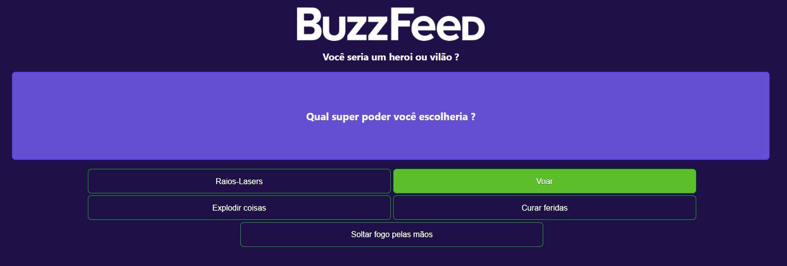

# ProjetoBuzzfeed

Um Projeto baseado no **BUZZFEED** que traz um a essência de um dos maiores sites de quis da internet, aproveite e divirta se com esse projeto divertido.

## Principais Funcionalidades:

<ul>
<li>✅ Interação com Questões</li>
<li>✅ Responsividade</li>
<li>⚒️ Assuntos Variados</li>
<li>⚒️ Categorias</li>
</ul>

## Detalhes Tecnicos do porjeto:

O projeto foi desenvolvido com as versões mais novas do **Angular**, **TypeScript**, **CSS** pensando em uma estrutura mais coesa, seguindo as boas práticas. 

Explorando os diversos recursos do **Angular módulos** e os inúmeros **Ng...** que facilitam o processo por meio da injeção de dependência.

Decide seguir com a implementação do grande [Felipão](https://github.com/felipeAguiarCode), e  tenho evoluindo baseado nas necessidades do projeto.

## Participações:
Esteja a vontade para participar deste projeto contribuindo com alguma ideia, ficarei feliz em ter sua contribuição.

Caso queira me conhecer melhor e quem saber trocar uma idade dá um pulo lá no Linkedin [Gonçalves](www.linkedin.com/in/jgoncalvessf). 

